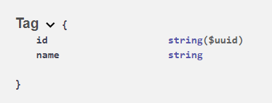
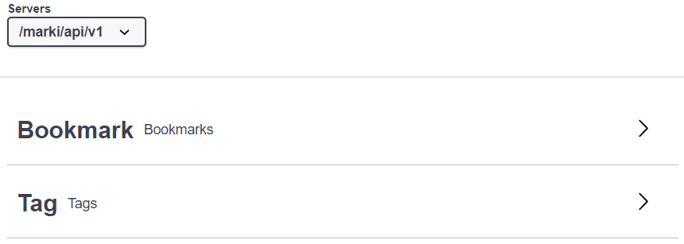
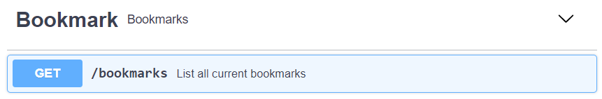
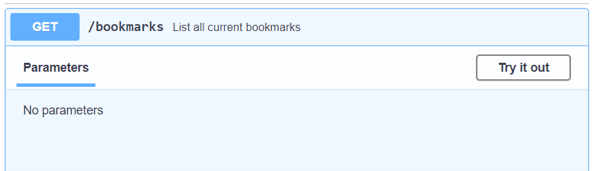
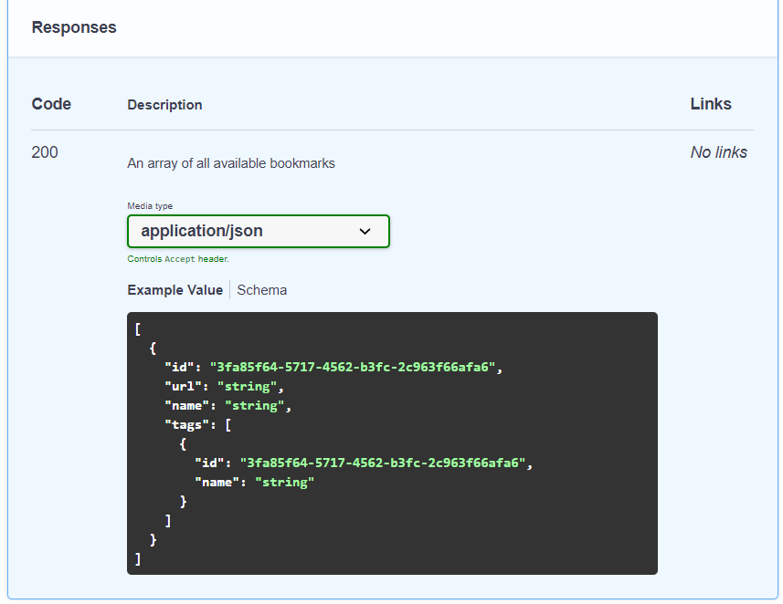

# OpenAPI 3.0

___
# Einleitung
> Be it the geometrical intricacy in Roman canals, the triangular symmetry in Egyptian pyramids, or the spatial harmony in Indian monasteries, standards and specifications have helped engineers set unique rules for sustainable engineering. - swagger.io

___

# Protokoll

- Feste Bedingungen
- Vertragliche Bindungen an Standard
- Dokument, nach welchem man sich richten kann
- Nutzung um Team/Firmenübergreifend Technologien zu verwenden

___

# Aber warum?

___

# Comic

___

# Der Vertrag

- Dokument, welches definiert, wie die API auszusehen hat
- An dieses Dokument halten sich alle Teams

___

# OpenAPI 3.0

- Api Definition in **YAML** oder Json

___

# Meta

```yaml
  openapi: "3.0.2"
  info:
    title: "Marki"
    description: "Sample Bookmarking API"
    contact:
      email: "api@sample.de"
    license:
      name: "License of API"
    version: "0.0.1"
  servers:
  - url: "/marki/api/v1"
```

___

# Objekte

```yaml
Tag:
  type: "object"
  required:
    - "name"
  properties:
    id:
      format: "uuid"
      type: "string"
    name:
      type: "string"
```
___

# Objekte



___

# Tags

```yaml
  tags:
  - name: "Bookmark"
    description: "Bookmarks"
  - name: "Tag"
    description: "Tags"
```

___

# Tags



___

# Erster Endpunkt

```yaml
paths:
  /bookmarks:
    get:
      summary: "List all current bookmarks"
      tags:
        - "Bookmark"
      responses:
        "200":
          description: "An array of all available bookmarks"
          content:
            application/json:
              schema:
                type: "array"
                items:
                  $ref: "#/components/schemas/Bookmark"
```
___


___

___

___

# Quellen

- [Zitat erste Seite - 24.11.2020](https://swagger.io/blog/api-strategy/benefits-of-openapi-api-development/)